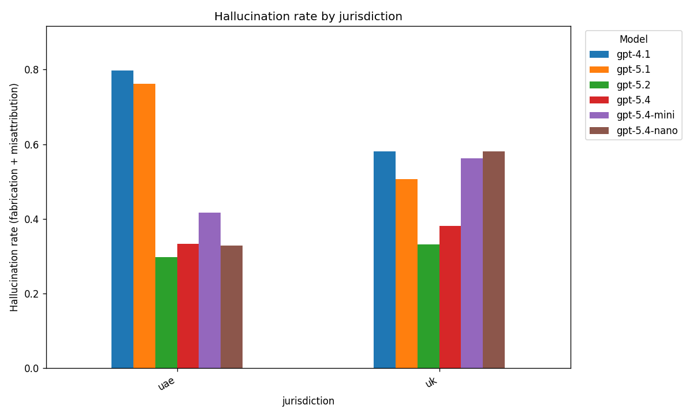
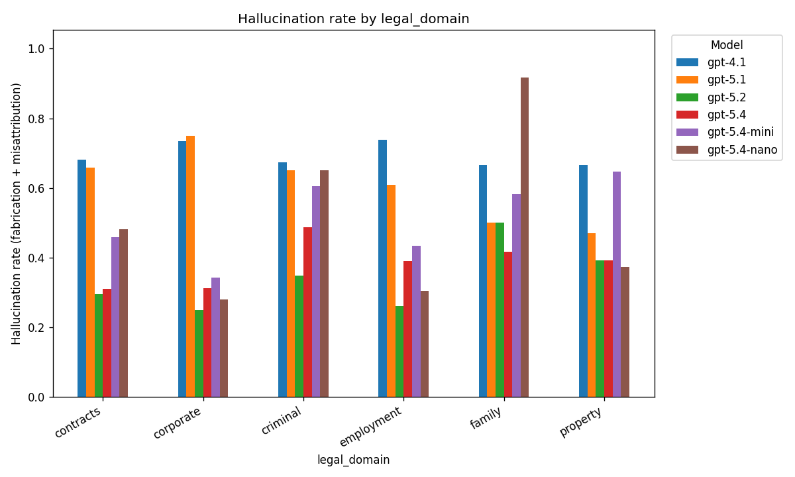
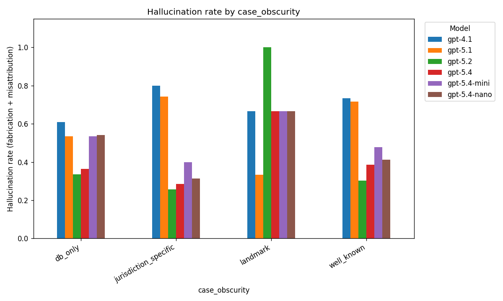
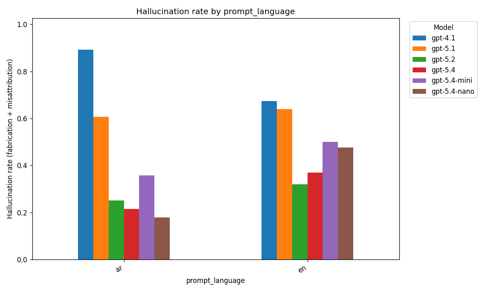

# Hallucination Benchmark Results

_Across 6 models, 1,968 judged responses, 328 benchmark items._

**Hallucination rate** = (fabrication + misattribution) / n.

## Overall (by model)

| model_id | n | correct | correct_refusal | misattribution | fabrication | hallucination_rate |
| --- | --- | --- | --- | --- | --- | --- |
| gpt-5.2 | 328 | 137 | 88 | 17 | 86 | 0.314 |
| gpt-5.4 | 328 | 150 | 61 | 20 | 97 | 0.3567 |
| gpt-5.4-nano | 328 | 67 | 113 | 21 | 127 | 0.4512 |
| gpt-5.4-mini | 328 | 109 | 59 | 19 | 141 | 0.4878 |
| gpt-5.1 | 328 | 81 | 38 | 22 | 187 | 0.6372 |
| gpt-4.1 | 328 | 81 | 20 | 41 | 186 | 0.6921 |

## By jurisdiction

| model_id | jurisdiction | n | correct | correct_refusal | misattribution | fabrication | hallucination_rate |
| --- | --- | --- | --- | --- | --- | --- | --- |
| gpt-4.1 | uae | 168 | 30 | 4 | 15 | 119 | 0.7976 |
| gpt-4.1 | uk | 160 | 51 | 16 | 26 | 67 | 0.5813 |
| gpt-5.1 | uae | 168 | 26 | 14 | 9 | 119 | 0.7619 |
| gpt-5.1 | uk | 160 | 55 | 24 | 13 | 68 | 0.5062 |
| gpt-5.2 | uae | 168 | 76 | 42 | 9 | 41 | 0.2976 |
| gpt-5.2 | uk | 160 | 61 | 46 | 8 | 45 | 0.3312 |
| gpt-5.4 | uae | 168 | 83 | 29 | 8 | 48 | 0.3333 |
| gpt-5.4 | uk | 160 | 67 | 32 | 12 | 49 | 0.3812 |
| gpt-5.4-mini | uae | 168 | 68 | 30 | 12 | 58 | 0.4167 |
| gpt-5.4-mini | uk | 160 | 41 | 29 | 7 | 83 | 0.5625 |
| gpt-5.4-nano | uae | 168 | 54 | 59 | 14 | 41 | 0.3274 |
| gpt-5.4-nano | uk | 160 | 13 | 54 | 7 | 86 | 0.5813 |

## By legal_domain

| model_id | legal_domain | n | correct | correct_refusal | misattribution | fabrication | hallucination_rate |
| --- | --- | --- | --- | --- | --- | --- | --- |
| gpt-4.1 | contracts | 135 | 35 | 8 | 14 | 78 | 0.6815 |
| gpt-4.1 | corporate | 64 | 14 | 3 | 8 | 39 | 0.7344 |
| gpt-4.1 | criminal | 43 | 13 | 1 | 7 | 22 | 0.6744 |
| gpt-4.1 | employment | 23 | 3 | 3 | 2 | 15 | 0.7391 |
| gpt-4.1 | family | 12 | 3 | 1 | 0 | 8 | 0.6667 |
| gpt-4.1 | property | 51 | 13 | 4 | 10 | 24 | 0.6667 |
| gpt-5.1 | contracts | 135 | 34 | 12 | 9 | 80 | 0.6593 |
| gpt-5.1 | corporate | 64 | 9 | 7 | 3 | 45 | 0.75 |
| gpt-5.1 | criminal | 43 | 12 | 3 | 5 | 23 | 0.6512 |
| gpt-5.1 | employment | 23 | 3 | 6 | 0 | 14 | 0.6087 |
| gpt-5.1 | family | 12 | 2 | 4 | 0 | 6 | 0.5 |
| gpt-5.1 | property | 51 | 21 | 6 | 5 | 19 | 0.4706 |
| gpt-5.2 | contracts | 135 | 62 | 33 | 8 | 32 | 0.2963 |
| gpt-5.2 | corporate | 64 | 31 | 17 | 4 | 12 | 0.25 |
| gpt-5.2 | criminal | 43 | 15 | 13 | 1 | 14 | 0.3488 |
| gpt-5.2 | employment | 23 | 5 | 12 | 2 | 4 | 0.2609 |
| gpt-5.2 | family | 12 | 1 | 5 | 0 | 6 | 0.5 |
| gpt-5.2 | property | 51 | 23 | 8 | 2 | 18 | 0.3922 |
| gpt-5.4 | contracts | 135 | 73 | 20 | 3 | 39 | 0.3111 |
| gpt-5.4 | corporate | 64 | 34 | 10 | 4 | 16 | 0.3125 |
| gpt-5.4 | criminal | 43 | 15 | 7 | 4 | 17 | 0.4884 |
| gpt-5.4 | employment | 23 | 5 | 9 | 2 | 7 | 0.3913 |
| gpt-5.4 | family | 12 | 2 | 5 | 0 | 5 | 0.4167 |
| gpt-5.4 | property | 51 | 21 | 10 | 7 | 13 | 0.3922 |
| gpt-5.4-mini | contracts | 135 | 49 | 24 | 7 | 55 | 0.4593 |
| gpt-5.4-mini | corporate | 64 | 33 | 9 | 4 | 18 | 0.3438 |
| gpt-5.4-mini | criminal | 43 | 12 | 5 | 3 | 23 | 0.6047 |
| gpt-5.4-mini | employment | 23 | 5 | 8 | 0 | 10 | 0.4348 |
| gpt-5.4-mini | family | 12 | 0 | 5 | 0 | 7 | 0.5833 |
| gpt-5.4-mini | property | 51 | 10 | 8 | 5 | 28 | 0.6471 |
| gpt-5.4-nano | contracts | 135 | 31 | 39 | 12 | 53 | 0.4815 |
| gpt-5.4-nano | corporate | 64 | 20 | 26 | 6 | 12 | 0.2812 |
| gpt-5.4-nano | criminal | 43 | 2 | 13 | 3 | 25 | 0.6512 |
| gpt-5.4-nano | employment | 23 | 5 | 11 | 0 | 7 | 0.3043 |
| gpt-5.4-nano | family | 12 | 0 | 1 | 0 | 11 | 0.9167 |
| gpt-5.4-nano | property | 51 | 9 | 23 | 0 | 19 | 0.3725 |

## By case_obscurity

| model_id | case_obscurity | n | correct | correct_refusal | misattribution | fabrication | hallucination_rate |
| --- | --- | --- | --- | --- | --- | --- | --- |
| gpt-4.1 | db_only | 146 | 41 | 16 | 18 | 71 | 0.6096 |
| gpt-4.1 | jurisdiction_specific | 70 | 12 | 2 | 11 | 45 | 0.8 |
| gpt-4.1 | landmark | 3 | 1 | 0 | 0 | 2 | 0.6667 |
| gpt-4.1 | well_known | 109 | 27 | 2 | 12 | 68 | 0.7339 |
| gpt-5.1 | db_only | 146 | 42 | 26 | 8 | 70 | 0.5342 |
| gpt-5.1 | jurisdiction_specific | 70 | 13 | 5 | 5 | 47 | 0.7429 |
| gpt-5.1 | landmark | 3 | 2 | 0 | 0 | 1 | 0.3333 |
| gpt-5.1 | well_known | 109 | 24 | 7 | 9 | 69 | 0.7156 |
| gpt-5.2 | db_only | 146 | 46 | 51 | 6 | 43 | 0.3356 |
| gpt-5.2 | jurisdiction_specific | 70 | 33 | 19 | 3 | 15 | 0.2571 |
| gpt-5.2 | landmark | 3 | 0 | 0 | 1 | 2 | 1.0 |
| gpt-5.2 | well_known | 109 | 58 | 18 | 7 | 26 | 0.3028 |
| gpt-5.4 | db_only | 146 | 52 | 41 | 7 | 46 | 0.363 |
| gpt-5.4 | jurisdiction_specific | 70 | 38 | 12 | 4 | 16 | 0.2857 |
| gpt-5.4 | landmark | 3 | 1 | 0 | 0 | 2 | 0.6667 |
| gpt-5.4 | well_known | 109 | 59 | 8 | 9 | 33 | 0.3853 |
| gpt-5.4-mini | db_only | 146 | 34 | 34 | 4 | 74 | 0.5342 |
| gpt-5.4-mini | jurisdiction_specific | 70 | 28 | 14 | 7 | 21 | 0.4 |
| gpt-5.4-mini | landmark | 3 | 1 | 0 | 0 | 2 | 0.6667 |
| gpt-5.4-mini | well_known | 109 | 46 | 11 | 8 | 44 | 0.4771 |
| gpt-5.4-nano | db_only | 146 | 14 | 53 | 7 | 72 | 0.5411 |
| gpt-5.4-nano | jurisdiction_specific | 70 | 24 | 24 | 7 | 15 | 0.3143 |
| gpt-5.4-nano | landmark | 3 | 1 | 0 | 0 | 2 | 0.6667 |
| gpt-5.4-nano | well_known | 109 | 28 | 36 | 7 | 38 | 0.4128 |

## By prompt_language

| model_id | prompt_language | n | correct | correct_refusal | misattribution | fabrication | hallucination_rate |
| --- | --- | --- | --- | --- | --- | --- | --- |
| gpt-4.1 | ar | 28 | 2 | 1 | 3 | 22 | 0.8929 |
| gpt-4.1 | en | 300 | 79 | 19 | 38 | 164 | 0.6733 |
| gpt-5.1 | ar | 28 | 6 | 5 | 1 | 16 | 0.6071 |
| gpt-5.1 | en | 300 | 75 | 33 | 21 | 171 | 0.64 |
| gpt-5.2 | ar | 28 | 14 | 7 | 2 | 5 | 0.25 |
| gpt-5.2 | en | 300 | 123 | 81 | 15 | 81 | 0.32 |
| gpt-5.4 | ar | 28 | 18 | 4 | 0 | 6 | 0.2143 |
| gpt-5.4 | en | 300 | 132 | 57 | 20 | 91 | 0.37 |
| gpt-5.4-mini | ar | 28 | 10 | 8 | 0 | 10 | 0.3571 |
| gpt-5.4-mini | en | 300 | 99 | 51 | 19 | 131 | 0.5 |
| gpt-5.4-nano | ar | 28 | 7 | 16 | 2 | 3 | 0.1786 |
| gpt-5.4-nano | en | 300 | 60 | 97 | 19 | 124 | 0.4767 |

